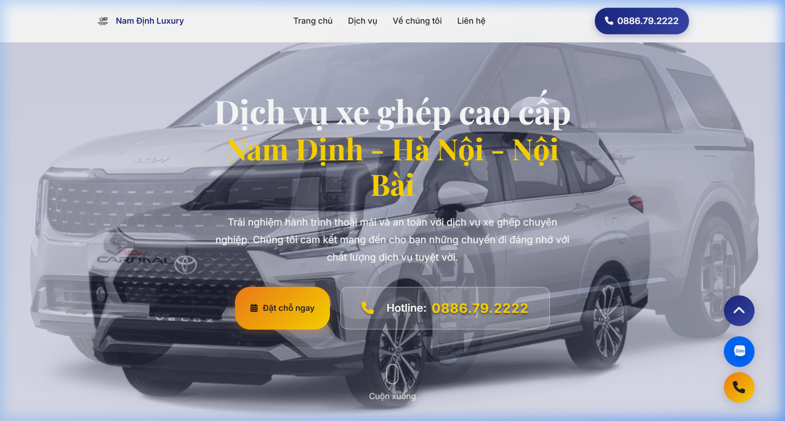

🇻🇳 [Đọc bằng tiếng Việt](README-vi.md)

# UI Car — Automotive Showroom Website

  

An automotive showroom website with PWA support and Zalo integration.

## Preview

## Features

- Vehicle photo gallery
- **PWA** — installable with service worker
- Zalo integration
- Mobile-first responsive

---

**Xuan Linh** — Fullstack Developer

 
